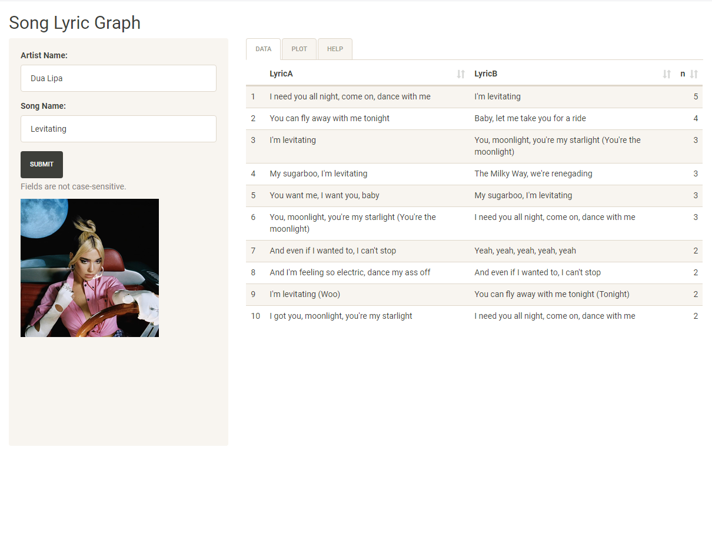
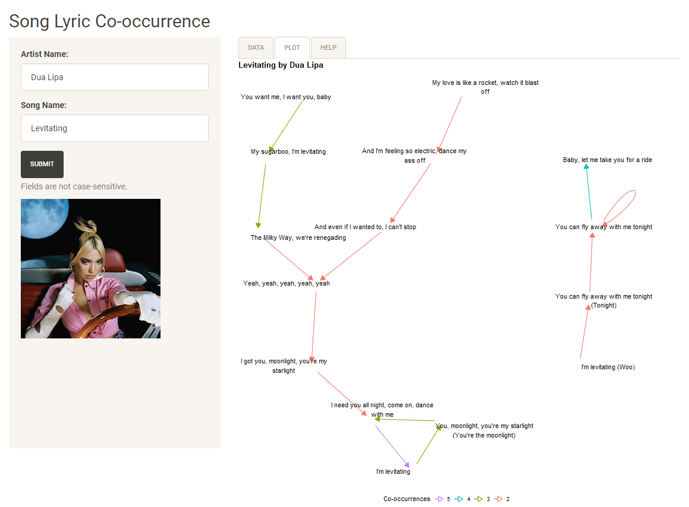

# Song Lyric Graph

A Shiny app that creates a directed graph to visualize song lyric co-occurrences. Song cover art and lyrics are obtained from [Genius](https://genius.com).

## Running the app

```
https://adamshen1.shinyapps.io/song-lyric-graph/
```

## Running the app locally

### Required packages

From the `global.R` file:

```r
library(shiny)
library(shinythemes)
library(rvest)
library(genius)
library(dplyr)
library(tidyr)
library(magick)
library(ggplot2)
library(igraph)
library(ggraph)
library(stringr)
```

Other required packages that are loaded but not attached: `purrr`, `DT`. Requires `tibble` 3.0.0 or higher.

```r
shiny::runGitHub(repo="song-lyric-graph", username="adamoshen")
```

## Demo




