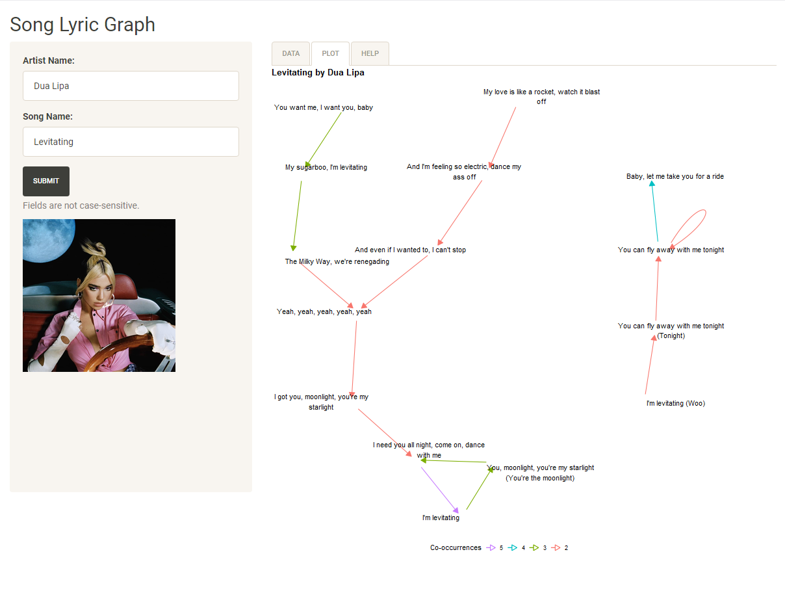

# Song Lyric Graph

A Shiny app that creates a directed graph to visualize song lyric
co-occurrences. Song cover art and lyrics are obtained from
[Genius](https://genius.com).

**This app is now archived.** Everytime Genius does some stuff that changes how
lyrics need to be scraped, the related functions in the Genius-related
packages need to be updated. This also means that this app needs to be updated
each time.

The code contained in `static.R` should provide a minimal working example
outside of the Shiny framework of the intended result.

## Demo

